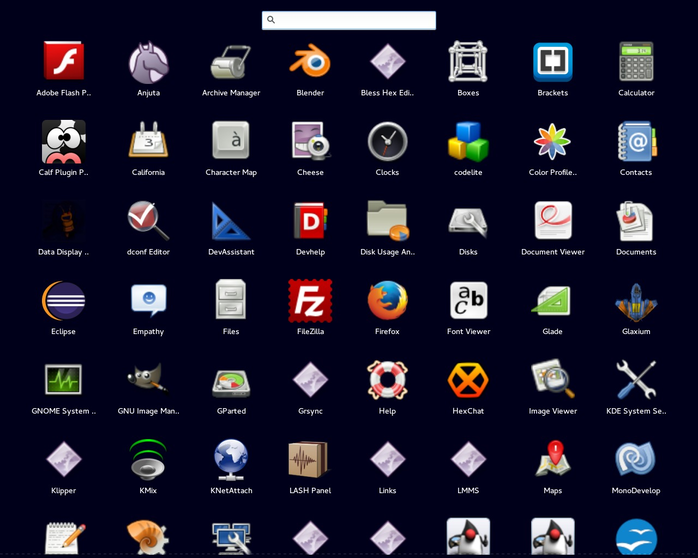

**Forked from Rocket-Launcher**

Rapid Launcher
===============

Rapid Launcher is an application launcher that is supposed to be fast and
relatively lightweight.

The backend is written in Vala (library from Rocket-Launcher) and the frontend is written with C/GTK+ 3.

Rapid Launcher is born to give a good launcher also for old PCs. It's really simple and is inspired by the Android and OSX launchers.

### Version
This is an **alpha** release.

### License

GPLv3